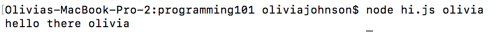

# JAVASCRIPT REVIEW

## Types Of Data
- numbers
- strings
- objects
- boolean
- undefined

### expression
```js
84 + 12
```
- 84 is a number
- '+' addition, * multiplication, / division, - subtraction are arithmetic opreators
- = is an assignment operator
- % is the modulous (finds remainder)
 + takes a large or infinate value set and gives it a range
 + example: clock 113 % 12 = 5

```js
x = x + 1
x += 1
x++
```
all the same way to write first expression

### variables
```js
 var apple = 12;
```
- variables store value in ram
- allocates a space in ram
- variables can be any word besides what Javascript already knows
- case sensitive


- statement- line of code (sentance)
- ;- end of line of code (period)
- expression- part of code (predicate)

```js
 let apple = 12;
 const apple = 12;
```
- const manages memory in ram better
+ use if you are using the variable for the whole program and won't change
- let helps you write better code by condensing

### strings
```js
 let name = "olivia"
```
 - "olivia" is a string
 - stores data as text
 - '+' can be used to add strings together

### objects
```js
 s = {age: 20, name: "olivia"}
```
 - s is an object
 - {} contain variables
 - s.age will output 20
 - s.name will output "olivia"
 - in Javascript everything is an object
 - . will pull data from variable

### boolean values
```js
x = false
```
true or false statements

### undefined
```js
let pizza
```
undefined as no value is assigned to the variable

## Operators
- operators operate on values in variables
- mutation able to be changed
- imutable cannot be changed

### arithmetic operators
```js
x = 1+3
y = 3
```
- '+' addition, * multiplication, / division, - subtraction are arithmetic opreators
- = is an assignment operator

### typeof operator
```js
typeof x
'number'
```
- defines what data type

### boolean operators
```js
 x > y
 true
 ```
- '>, >=, <=, <' return boolean (true or false)
- != not equal to

### logic operators
```js
y > x && y<z
true
```
 - Logic operator
 - && : and
 - || : or

## Arrays
```js
let primes = [2,3,5,7,11]
```
- uses brackets
- uses commas
- only uses values

```js
let primes = [2,3,5,7,11]
console.log(primes[2])
>5
```
- how to pull a number from an array
- answer is 5 because it is in the 2nd index

### length
```js
let primes = [2,3,5,7,11]
console.log(primes.length)
>5
```
this will give the amount of values in the array

### push
```js
let primes = [2,3,5,7,11]
primes.push(13)
console.log(primes)
```
adds 13 to the end of the array

### pop
```js
let primes = [2,3,5,7,11]
primes.pop()
console.log(primes)
```
removes last number from array

### shift
```js
let primes = [2,3,5,7,11]
primes.shift()
console.log(primes)
```
removes first number in array

### unshift
```js
let primes = [2,3,5,7,11]
primes.unshift(1)
console.log(primes)
```
adds number to beginning of Array

### splice
```js
let primes = [2,3,5,7,11]
primes.splice(1,2)
console.log(primes)
```
will remove 1st and 2nd index of arrays

```js
console.log(process.argv)
```
creates an array of where the date is store

```js
let greeting = "hello there "
let name = process.argv[2]
console.log( greeting + name )
```

prints this

## Conditional statements
```js
if(){

}
else if(){

}
else(){

}
```
## Loops
### while loops
```js
let milesLeft = 10

while( milesLeft > 0){
  if(milesLeft == 1){
    console.log('almost there!')
  } else{
  console.log('are we there yet')
}
  milesLeft --
}
console.log('yay weve arrived')
```
### for loops
```js
for(let milesLeft=10; milesLeft>0; milesLeft --){

  if(milesLeft==1){
    console.log('almost there')
  } else {
    console.log('are we there yet')
  }

}
console.log("yay we've arrived")
```
# HOW TO ADD JAVASCRIPT TO HTML

```html
<!DOCTYPE html>
<html lang="en" dir="ltr">
  <head>
    <meta charset="utf-8">
    <title></title>
  </head>
  <body>
    fhrhgk
  </body>
  <script>https://p5js.org/</script>
  <script>

function setup(){
    createCanvas(innerWidth,innerHeight)
    fill(0,0,0)
    let y=10


    let x=0
    while(x<width){
      ellipse(x,y,20)
      x+=20
    }

    y+=20
    for(let x=0; x<width; x+=20){
      ellipse(x,y,20)
    }
}
</script>
</html>
```
